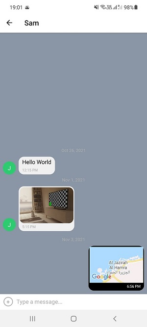

### Hello World Chat App ###

#### Project Objectives: ####
To build a chat app for mobile devices using React Native. The app will provide users with a chat interface and options to share images and their location.

#### Key Features: ####
- A page where users can enter their name and choose a background color for the chat screen before joining the chat.
- A page displaying the conversation, as well as an input field and submit button.
- The chat must provide users with two additional communication features: sending images and location data.
- Data gets stored online and offline

#### Dependencies: ####
- React Native
- Expo
- Expo Image Picker
- Expo location
- Gifted Chat
- Google Firebase
- Firebase Cloud Storage
- JavaScript
- Proptypes

#### START APPLICATION USING: ####
##### REQUIREMENTS #####
- Node.js
- Expo Command Line Interface

npm install --global expo-cli

##### Initial Setup #####
Clone the repo or download the files, and install dependencies

npm install

##### Expo Set Up on Mobile Device #####

As you will need the Expo app for your phone to run your project on, search for the Expo app in the relevant app store for your device (iOS or Android). Once you have found it, download it onto your mobile device. The app icon should look something like this:

##### Set Up on Emulator(Android) or Simulator(iOS) #####
To set up the iOS simulator, you need XCode on your Mac. It’s available to download from the <a href="https://itunes.apple.com/app/xcode/"> App Store.</a>
To set up the Android, you need to set up <a href="https://developer.android.com/studio">Android Studio</a>

##### Run the App #####
Go to the project folder in your command line and run the app by using:
expo start

##### Run App Using Emulator (Android) or Simulator(iOS) #####
In the browser after run expo start, select "Run on iOS Simulator" or "Run on Android device/emulator". Ensure that your Emulator or Simulator is already up and running, otherwise you might encounter issues when you select "Run on iOS Simulator" or "Run on Android device/emulator" in the browser.

#### Firebase Database Set Up #####
For database to store collections and documents, you will need to setup your own <a href="https://firebase.google.com/">firebase database</a> and add your own database credentials under the "Firebase Config Details", then allow anonymous authorization with your Database.

##### Screenshots of Features #####
Send a chat, take a photo and share location

#### Author: ####
:camel: Rina Ong-Oehme

#### Acknowledgements: ####
Treasure Kabareebe